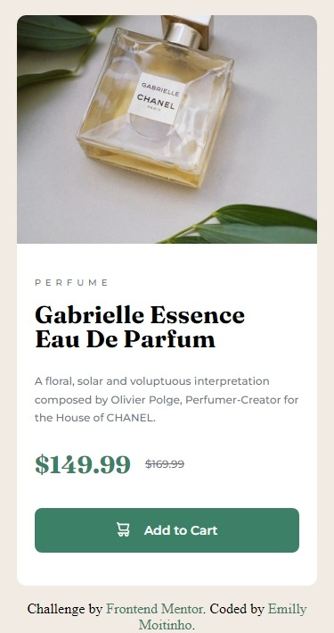
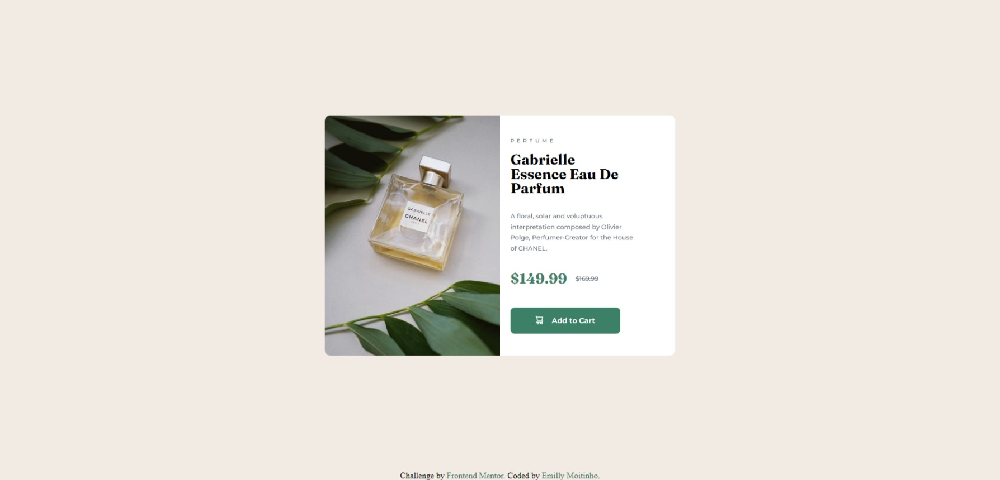

# Repositório "Responsive Layout"
O repositório responsive_layout é dedicado a compartilhar os projetos e desafios que realizo relacionados à construção de layouts responsivos. O objetivo desse repositório é aprimorar minha habilidade de criar páginas web que se adaptem de maneira eficiente a diferentes tamanhos de tela.

## Desafio
Cada desafio está em uma pasta separada, com o código fonte e arquivos necessários para visualizar o projeto. Eles variam em nível de dificuldade.

### Cartão de Produto (Product Preview Card) 🫧🧴✨
Um desafio simples com HTML e CSS para iniciantes, focado em praticar layouts responsivos básicos.

Site: [Product Preview Card](https://emillymoitinho.github.io/responsive_layouts/product-preview-card-component-main/)

Repositório: [Repositório Product Preview Card](https://github.com/emillymoitinho/responsive_layouts/tree/main/product-preview-card-component-main)

Link do desafio: [Frontend Mentor](https://www.frontendmentor.io/solutions/card-perfume-s3L2mvOfS0)

- Mobile:
  

- Desktop:
  

